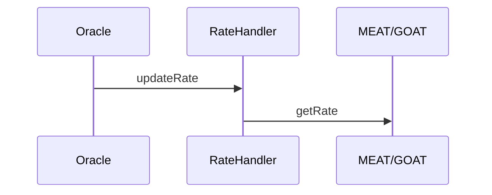
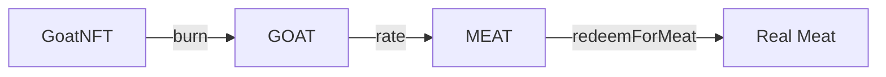

# Kontrak Token GOAT dan MEAT

Repositori ini berisi dua token ERC20:

- **GOAT** (Guardian of Agricultural Trade) mendukung proses staking dan penggabungan imbalan. Kontrak MEAT yang ditunjuk dapat mencetak token GOAT baru sementara pemegang token dapat melakukan staking guna memperoleh imbal hasil tahunan yang tinggi.
- **MEAT** (Market-Enabled Agricultural Token) memungkinkan pengguna mencetak token dengan mata uang native dan menukar ke ataupun dari GOAT sehingga menjadi gerbang utama bagi ekosistem.

## Cara Kerja Token

Berikut gambaran umum alur penggunaan kedua token:

1. **Mint MEAT** – Kirim native token langsung ke alamat kontrak `MEAT` untuk mencetak token sesuai rasio `DepositRate`. Fungsi `receive()` otomatis memproses dana dan mengirim MEAT ke pengirim. Versi CosmWasm menggunakan pesan `mint_with_native` seperti dijelaskan pada bagian berikutnya.
2. **Swap MEAT ⇄ GOAT** – Fitur swap aktif jika `swapEnabled` bernilai `true`. Rasio konversi diperoleh dari `RateHandler` yang bisa diperbarui oleh Oracle melalui `updateRate`. Bila `dynamicRateValid` `false` (contohnya setelah `invalidateRate`), kontrak otomatis memakai `SWAP_RATE` dari `SwapConfig` (default `85`). Fungsi `swapMEATForGOAT` menukar MEAT yang dimiliki pengguna menjadi GOAT, sedangkan `swapGOATForMEAT` melakukan sebaliknya.
RateHandler mencatat pembaruan melalui event `RateUpdated` dan `RateInvalidated` untuk audit. Alur singkatnya:

3. **Stake GOAT** – Pemegang GOAT dapat memanggil `stake(amount)` pada kontrak GOAT untuk mulai memperoleh reward. Besarnya reward dihitung linier berdasarkan `rewardRate` dengan periode akrual `rewardInterval`.
   *Memanggil `stake()` lagi akan mengatur ulang `lastStakedTime` dan membuang reward yang belum diambil, jadi sebaiknya `claimReward` terlebih dahulu sebelum menambah stake.*
4. **Claim atau Compound** – Setelah melewati `minClaimInterval`, pengguna dapat mencairkan reward melalui `claimReward` atau melakukan `compoundReward` agar hasilnya otomatis ditambahkan ke saldo staking.
5. **Redeem MEAT** – Panggil `redeemForMeat(amount)` untuk membakar token MEAT dan men-trigger distribusi daging secara off-chain. Fungsi ini mengurangi saldo MEAT dan memancarkan event `MeatRedeemed`.

## Burn & Redeem Flow

Diagram sederhana berikut menjelaskan jalur dari kambing hidup hingga daging siap tebus:

Berikut langkah detail siklus kambing hingga daging tercatat di ledger:

- Kambing lahir → pencetakan **GoatNFT** dengan `nfcId`, `breed`, `birthYear`, dan `weight` awal.
- `nfcId` bersifat unik; pencetakan kedua dengan ID sama akan gagal.
 - Pemilik dapat memperbarui berat melalui `updateWeight()` agar nilainya tetap valid (dibutuhkan sebelum burn).
 - Nilai `weight` disimpan dengan satu tempat desimal menggunakan `WEIGHT_DECIMALS = 1` sehingga `425` berarti **42.5 kg**.
- NFT (standar ERC721) bebas dipindahtangankan ke pemilik baru.
- Ketika kambing disembelih, pemilik membakar NFT; kontrak otomatis mencetak GOAT sejumlah `weight / rate` dimana `rate` berasal dari `RateHandler`.
- GOAT dapat diperdagangkan atau ditukar menjadi MEAT memakai fungsi swap kontrak.
- MEAT kemudian ditebus sebagai daging nyata sehingga seluruh riwayat ternak tersimpan on-chain.



- Membakar `GoatNFT` otomatis mencetak GOAT sejumlah `weight / rate`.
- GOAT dapat ditukar dengan MEAT atau sebaliknya menggunakan rate yang sama dari `RateHandler`.
- Pemegang MEAT menukarkan tokennya lewat `redeemForMeat` untuk menerima daging fisik. **1 MEAT setara 1 KG daging**.

## What is GoatNFT?

GoatNFT bukan sekadar NFT koleksi. Token ini berfungsi sebagai **identitas digital** dan **ledger siklus hidup** bagi setiap kambing di ekosistem. Setiap NFT mencatat `nfcId`, ras, tahun lahir, dan berat yang terus diperbarui hingga saat penyembelihan.

### Digital Commodity Identity

- **Birth Certificate** – GoatNFT dicetak saat kambing lahir atau didaftarkan.
- **Living Ledger** – Berat terakhir selalu di-update agar valuasi mengikuti kondisi riil.
- **Ownership Record** – Mengikuti standar ERC721 sehingga kepemilikan dapat dipindahtangankan.
- **Slaughter Certificate** – NFT wajib dibakar ketika kambing disembelih; pembakaran ini otomatis mencetak token GOAT berdasarkan berat terakhir.
- **Fraud Prevention** – Proses burn menghapus NFT selamanya sehingga tidak ada klaim ganda.

### Lifecycle Tokenization

Alurnya ringkas sebagai berikut:

```
Goat lahir → mint GoatNFT → update berat → transfer bila dijual → burn saat disembelih → mint GOAT → swap ke MEAT → tebus daging fisik
```

Semua peristiwa tersebut tercatat on-chain sehingga pasokan GOAT dan MEAT selalu dapat diaudit. Dengan desain ini, nilai digital senantiasa terhubung ke komoditas nyata.

## Deployment

1. Install all dependencies from this repository:
   ```bash
   npm install
   ```
2. Compile the contracts using the `hardhat.config.js` in this repository:
   ```bash
   npx hardhat compile
   ```
3. Deploy the contracts with your preferred Hardhat network configuration. A simple script might look like:
   ```javascript
   const GOAT = await ethers.getContractFactory('GOAT');
   const goat = await GOAT.deploy(ethers.ZeroAddress);
   await goat.waitForDeployment();

   const MEAT = await ethers.getContractFactory('MEAT');
   const meat = await MEAT.deploy(goat.target);
   await meat.waitForDeployment();

   await goat.setMEATAddress(meat.target);

   console.log('GOAT deployed to:', goat.target);
   console.log('MEAT deployed to:', meat.target);
   ```
Jalankan dengan perintah `npx hardhat run scripts/deploy.js --network <network>` dan ganti `<network>` sesuai konfigurasi Hardhat yang diinginkan.

## Contoh Konfigurasi Hardhat

Tambahkan pengaturan jaringan pada `hardhat.config.js` agar skrip `deploy.js` dapat dijalankan ke testnet. Misalnya untuk jaringan Sepolia:

```javascript
require("@nomicfoundation/hardhat-toolbox");

module.exports = {
  solidity: "0.8.29",
  networks: {
    sepolia: {
      url: "https://rpc.sepolia.org",
      accounts: ["0xYOUR_PRIVATE_KEY"]
    }
  }
};
```

Jalankan perintah berikut untuk melakukan deploy:

```bash
npx hardhat run scripts/deploy.js --network sepolia
```

## Build Artifacts

Folder `artifacts/` dihasilkan oleh Hardhat dan skrip build CosmWasm namun tidak disimpan di Git. Isi folder ini secara lokal dengan menjalankan konfigurasi Hardhat pada `hardhat.config.js` atau skrip build berikut:

```bash
npx hardhat compile
# or
./wasm-contracts/build.sh
```

1. **EVM** – kompilasi kontrak Solidity dan hasilkan file ABI:
   ```bash
   npx hardhat compile
   ```
   Salin berkas ABI JSON dari `artifacts/contracts/` ke `backend/abi/` jika Anda mengubah kontraknya.
2. **CosmWasm** – bangun paket Rust:
   Pasang target build jika dibutuhkan:
   ```bash
   rustup target add wasm32-unknown-unknown
   ```
   Kemudian jalankan:
   ```bash
   ./wasm-contracts/build.sh
   ```
   Skrip menghasilkan berkas `.wasm` ke `artifacts/` dan menuliskan berkas skema pada masing-masing paket.

## Perbandingan Perilaku CosmWasm

Folder `wasm-contracts/` menyimpan versi CosmWasm dari setiap kontrak. Seluruh
pesan mengikuti fungsi di Solidity namun ada beberapa perbedaan tak terelakkan:

 - **MEAT**: Pada `MEAT.sol` pengguna cukup mengirim native token dan fungsi
   `receive()` otomatis mencetak token. CosmWasm tidak menyediakan mekanisme
   auto‑mint saat menerima dana tanpa pesan sehingga pengguna **harus** memanggil
   `mint_with_native` sambil menyertakan koin. Versi CosmWasm juga menyediakan
   pesan `redeem_for_meat` serta mendukung penggunaan paket `ratehandler` untuk
   pembaruan rasio dinamis ketika implementasinya siap.
- **GOAT**: Kontrak `starter` mereplikasi logika staking, klaim, kompaun dan
  pembakaran NFT. Event Solidity diterjemahkan menjadi atribut di response
  CosmWasm, sedangkan cara perhitungan reward sama persis.
- **GoatNFT**: Struktur data serta fungsi `mint` dan `burn` identik. Perbedaan
  hanya terletak pada penamaan pesan. Kontrak ini tetap mendukung `update_weight`
  dan memeriksa kesegaran data berat seperti implementasi Solidity.

Secara umum kedua implementasi mempertahankan rasio reward dan swap yang sama
agar perilaku ekonomi konsisten di EVM maupun Cosmos.

## Parameter Penting

- **SWAP_RATE** – konstanta di `SwapConfig` yang menjadi fallback pada `RateHandler`. Nilai default `85` berarti 1 GOAT setara dengan 85 MEAT.
- **dynamicRate** – nilai saat ini dari RateHandler jika masih valid. Diset lewat `updateRate` yang memancarkan event `RateUpdated`. Jika dinonaktifkan dengan `invalidateRate`, kontrak memakai `SWAP_RATE` dan event `RateInvalidated` dicatat.
- **DepositRate** – rasio pencetakan MEAT ketika menerima native token. Nilai
  dihitung per `DEPOSIT_DIVISOR` (1000) unit native token sehingga `100` berarti
  100 MEAT untuk 1000 unit native (0.1 MEAT per 1 unit).
- **rewardRate** – tingkat imbal hasil tahunan di kontrak GOAT (dalam skala
  `1e18`). Nilai ini dikombinasikan dengan `rewardInterval` untuk menghitung
  reward harian pengguna.
- **minClaimInterval** – interval minimum pengguna dapat mengklaim atau
  meng-unstake dengan reward. Default-nya `7 days`.
 - **LOD** – Level of Decay per komoditas. Nilai awal dihasilkan oleh skrip
   [`compute_lod.py`](compute_lod.py) dan tersimpan di `lod_data.json`. Data tersebut dapat
  diperbarui on-chain lewat `setCommodityRepresentation` pada `RateHandler`.
  Setiap komoditas menyimpan `lodPerDay` untuk layer `NFT`, `VIRTUAL`, dan
  `PRODUCT` beserta parameter transparan seperti `protein_g_per_kg`,
  `fat_g_per_kg`, `micronutrient_index_x1000`, `yield_per_cycle_kg`, dan
  `cycle_time_days`. Rasio barter antar layer dihitung dengan
  `computeBarterRate(fromCommodity, fromLayer, toCommodity, toLayer)` yang
  mengembalikan `(lodFrom * 1e18) / lodTo`.

### Memperbarui Data LOD

Apabila parameter komoditas pada `compute_lod.py` diubah, jalankan ulang skrip
tersebut dengan:

```bash
python3 compute_lod.py
```

File `lod_data.json` yang dihasilkan sebaiknya ikut dikomit agar perubahan LOD
dapat ditinjau secara transparan. Detail tata kelola LOD selengkapnya tersedia
di [docs/lod-governance.md](docs/lod-governance.md).

## Events

Perubahan alamat penting pada kontrak GOAT dan GoatNFT dapat dipantau melalui event berikut:

- `MeatAddressUpdated(oldAddress, newAddress)` dicatat ketika pemilik mengganti
  alamat kontrak MEAT.
- `NftAddressUpdated(oldAddress, newAddress)` dicatat saat alamat GoatNFT diubah.
- `GoatAddressUpdated(oldAddress, newAddress)` dicatat ketika alamat GOAT pada kontrak MEAT diubah.
- `GoatTokenAddressUpdated(oldAddress, newAddress)` dicatat ketika kontrak GoatNFT mengubah alamat GOAT yang dipakai untuk mint.
- `RateUpdated(newRate, timestamp)` dicatat oleh RateHandler ketika pemilik mengatur konversi baru.
- `RateInvalidated(timestamp)` dicatat saat pemilik menonaktifkan rate dinamis sehingga fallback ke `SWAP_RATE`.
- `OwnershipTransferred(oldOwner, newOwner)` dicatat ketika kepemilikan RateHandler dialihkan ke alamat baru.

MEAT juga memunculkan event utama berikut:

- `MintedWithNative(user, nativeReceived, meatMinted)` dicatat ketika kontrak
  menerima native token dan mencetak MEAT. Pada versi CosmWasm event ini
  dipicu saat `mint_with_native` dipanggil.
- `SwapEnabledUpdated(status)` dicatat ketika pemilik mengubah status swap
  MEAT dan GOAT.

## Running Tests

Seluruh pengujian Hardhat berada di direktori `test/`. Jalankan dengan perintah berikut:

```bash
npm install
```

Jika folder `artifacts/` belum berisi kontrak terkompilasi, jalankan:

```bash
npx hardhat compile
```

Setelah itu eksekusi seluruh test dengan:

```bash
npx hardhat test
```


## Backend Server

Backend Express sederhana di folder `backend/` menyediakan analitik kontrak secara cache. Jalankan dengan perintah berikut:

```bash
npm run start:server
```

Siapkan variabel lingkungan sebelum menyalakan server:
```bash
cp backend/.env.example backend/.env
```
Edit `backend/.env` lalu isi `RPC_URL`, `GOAT_ADDRESS`, `MEAT_ADDRESS`, dan `PORT` agar server dapat membaca data on-chain setelah kompilasi Hardhat.

### API Endpoints
- `GET /health` – health check.
- `GET /stats` – cached stats like total supply and total staked.

Frontend mengambil data dari endpoint-endpoint ini alih-alih langsung mengakses blockchain.

## Frontend Setup

Antarmuka pengguna lengkap berada pada repositori terpisah sehingga proyek ini dapat berfokus pada smart contract dan utilitas backend. Template Next.js minimal tetap disertakan di direktori `frontend/` sebagai placeholder dan contoh penggunaan variabel lingkungan.

Clone repositori UI terpisah (jika tersedia) dan ikuti README‑nya untuk proses instalasi serta perintah `npm run dev`. Siapkan variabel lingkungan dengan:
```bash
cp frontend/.env.example frontend/.env.local
```
Setelah itu edit `frontend/.env.local` dan isi `NEXT_PUBLIC_GOAT_ADDRESS` serta `NEXT_PUBLIC_MEAT_ADDRESS` sesuai alamat hasil deploy.

## 🧱 Struktur Kontrak

Struktur dan hubungan antar kontrak:
- `GOAT` (`contracts/GOAT.sol`) mewarisi `ERC20` OpenZeppelin dan menambahkan
  fungsi staking, klaim, kompaun, serta konfigurasi reward. Hanya kontrak `MEAT`
  yang dapat mencetak GOAT melalui `mintTo`. Versi CosmWasm memakai pesan `burn_and_mint` untuk menebus GoatNFT dan menyediakan `emergency_unstake`.
- `MEAT` (`contracts/MEAT.sol`) adalah token `ERC20` yang menerima native token
  untuk mint, memungkinkan penukaran MEAT ↔ GOAT, dan mengontrol fitur swap. Pesan baru `redeem_for_meat` membakar MEAT untuk menebus daging. Pengaturan `set_rate_handler` menghubungkan kontrak RateHandler guna mendukung rasio dinamis.
- `GoatNFT` (`contracts/GoatNFT.sol`) menyimpan identitas kambing sebagai NFT.
  Metadata tiap token dikemas dalam struct `GoatData` (`nfcId`, `breed`,
  `birthYear`, `weight`, `mintedAt`) dan disimpan pada mapping `goatMetadata`.
  Pemilik dapat memperbarui berat melalui `updateWeight` (memancarkan `WeightUpdated`); berat terakhir harus
  masih valid (<=7 hari) saat dibakar. Fungsi `burn` kini memanggil kontrak GOAT untuk mencetak token otomatis dan memancarkan event `GoatBurned` berisi jumlah GOAT yang dicetak. Data dapat dibaca ulang melalui `getGoatData` dan dihapus setelah `burn`.
- `IGOAT` (`contracts/interfaces/IGOAT.sol`) mendefinisikan fungsi `mintTo`
  untuk dipanggil MEAT saat membutuhkan GOAT baru. `IGoatToken` dipakai GoatNFT agar kontrak GOAT dapat mencetak token saat NFT dibakar.
- `FailingGOAT` (`contracts/mocks/FailingGOAT.sol`) digunakan pada unit test
  guna mensimulasikan kegagalan `transfer`.
- `emergencyUnstake` memungkinkan penarikan token yang di-stake tanpa reward kapan saja.

### Contoh Penggunaan

```solidity
// asumsikan "nft" dan "goat" sudah terdeploy
nft.burn(tokenId);

Alur panggilan eksternal–internal secara ringkas:
1. `swapMEATForGOAT` memanggil `transferFrom` MEAT dan `mintTo` GOAT jika saldo
   tidak mencukupi.
2. `stake` mentransfer GOAT ke kontrak lalu mencatat waktu. Perhitungan reward
   dilakukan fungsi internal `calculateReward`.
3. `claimReward`, `compoundReward`, dan `unstake` kini memuat `lastStakedTime`
   ke variabel lokal lalu meneruskannya ke `calculateReward` sebelum mentransfer
   atau mencetak token ke pengguna.

## 🔁 Flow Logic

Simulasi tahapan staking hingga unstake:

1. Pengguna memperoleh GOAT lalu memanggil `stake(amount)`.
2. Setelah `minClaimInterval` terlewati, pengguna dapat:
   - `claimReward` untuk mengambil hasil tanpa menarik pokok;
   - `compoundReward` agar hasil otomatis ditambahkan ke saldo staking.
3. Ketika keluar, panggil `unstake` sehingga pokok dan reward terkirim dan data
   staking dihapus. Fungsi ini juga mengatur `lastStakedTime` kembali ke `0`
   agar status staking pengguna bersih.

4. Dalam keadaan darurat, `emergencyUnstake` dapat digunakan kapan saja untuk menarik pokok tanpa reward. Fungsi ini juga menghapus `lastStakedTime` sehingga status staking benar-benar bersih.

Reward dihitung berbasis waktu (detik) sehingga tidak bergantung pada jumlah
blok. Perubahan state utama terjadi pada `stakingBalance`, `lastStakedTime`, dan
saldo token pengguna.

## 🧠 Perubahan Terakhir

Commit *Simplify MEAT swap allowance logic (#12)* merombak mekanisme swap:

- Penghapusan pemeriksaan allowance manual di fungsi-fungsi swap MEAT.
- Mengandalkan revert bawaan `transferFrom`/`transfer` bila allowance kurang.
- Mock `FailingGOAT` diperbarui agar dapat mensimulasikan kegagalan transfer.
- Test `meat.test.js` menyesuaikan dengan perilaku revert baru.

Perubahan ini menyederhanakan kode dan memastikan kegagalan transfer terdeteksi
otomatis.

## 🧪 Testing

Cakupan unit test meliputi:

- Deployment GOAT dan MEAT beserta kepemilikan serta suplai awal.
- Proses staking, klaim, unstake, dan swap (`stakingSwap.test.js`).
- Pengujian interval klaim (`claim.test.js`).
- Simulasi kegagalan transfer pada swap (`meat.test.js`).

Untuk kontrak CosmWasm, jalankan skrip build berikut terlebih dahulu:

```bash
rustup target add wasm32-unknown-unknown
./wasm-contracts/build.sh
```

Skrip ini akan membangun `starter`, `meat`, dan `goatnft`, menyalin semua file `.wasm` ke folder `artifacts` dan menulis schema di masing-masing paket.
Jika perintah `cargo schema` belum tersedia, jalankan `cargo install cargo-run-script` terlebih dahulu.

Unit test Rust di setiap paket dapat dijalankan dengan:

```bash
cargo test
```

Assertion penting mengecek perubahan saldo, event tidak ter-revert, dan update
waktu klaim. Belum tersedia tes batas untuk jumlah ekstrem atau konsumsi gas.

## 💬 Filosofi & Manifestasi

Kontrak dirancang menjaga nilai GOAT dan MEAT dengan imbal hasil tinggi namun
terkontrol. Reward dihitung per detik (setara harian) sehingga tidak terikat
kecepatan blok dan cocok lintas jaringan.

Pemanggilan `claimReward` tidak otomatis menambah stake agar pengguna bebas
menarik hasil tanpa memperpanjang penguncian. Fleksibilitas ini diharapkan
mencegah inflasi berlebih sekaligus memberi kontrol penuh pada komunitas.

## Visi Monetary 5.0

Repositori beserta kodenya sengaja dibuka dan dibuat transparan.
Tujuannya bukan mengunci sistem, melainkan **memungkinkan replikasi, pemahaman, dan adopsi** di sebanyak mungkin komunitas.

Anda didorong untuk me-*fork*, mempelajari, mengimplementasikan, serta meningkatkan sistem ini — **selama prinsip transparansi, keadilan, dan integritas nilai berbasis siklus hidup tetap dijaga.**

**Uang sejati hanyalah mitos — yang bertahan adalah sistem. Nilai harus senantiasa hidup.**

### Prinsip Panduan:

- Penancapan nilai pada seluruh siklus hidup
- Transparansi pasokan dan alur
- Pertukaran nilai yang adil dan dapat ditebus
- Arsitektur antiinflasi dan antijerat fiat
- Adopsi dan tata kelola yang digerakkan komunitas

## 📚 Dokumentasi Tambahan

Dokumen pendukung lain tersedia untuk memahami keseluruhan proyek:

- [System Architecture](architecture.md)
- [Frontend Flow](frontend-flow.md)
- [User Journey](user-journey.md)
- [GOAT & MEAT Lifecycle](goat-meat-lifecycle.md)
- [Contract Map](contract-map.md)
- [Integration Bridge](integration-bridge.md)
- [CosmWasm Deployment](docs/wasm-deploy.md)
- [Frontend Pages](docs/frontend-pages.md)
- [LOD Governance](docs/lod-governance.md)
- [Governance Pipeline](docs/governance-lod-engine.md)

---

Bukan sekadar dokumen, README ini menjadi "suara sistem" yang terus diperbarui
dan dipertanggungjawabkan.
