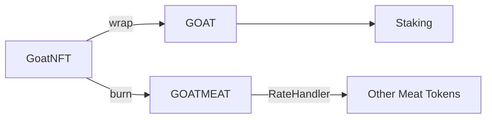
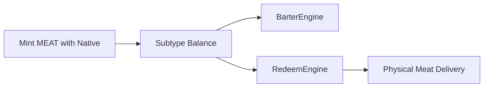

# Kontrak Token GOAT dan MEAT

Repositori ini berisi dua token ERC20:

- **GOAT** (Guardian of Agricultural Trade) mendukung proses staking. Token GOAT dicetak saat `GoatNFT` dikunci melalui `GoatNFTWrapper`. Pemegang dapat melakukan staking guna memperoleh imbal hasil tahunan tinggi.
- **MEAT** (Market-Enabled Agricultural Token) memungkinkan pengguna mencetak token dengan mata uang native dan menjadi gerbang utama bagi ekosistem.

## Cara Kerja Token

Berikut gambaran umum alur penggunaan kedua token:

1. **Mint MEAT** – MEAT dapat dicetak dengan mengirim token native ke kontrak `MEAT` yang diproses otomatis oleh `receive()` sesuai `DepositRate`, atau melalui `mintSubtype` oleh minter terotorisasi seperti hook pembakaran NFT. Saat kontrak dideploy, suplai awal juga dicetak ke alamat pemilik. Versi CosmWasm menggunakan pesan `mint_with_native` untuk cara pertama.
   *MEAT dapat dicetak lewat deposit token native maupun `mintSubtype` oleh kontrak terotorisasi.*
2. **Stake GOAT** – Pemegang GOAT dapat memanggil `stake(amount)` pada kontrak GOAT untuk mulai memperoleh reward. Besarnya reward dihitung linier berdasarkan `rewardRate` dengan periode akrual `rewardInterval`.
   *Memanggil `stake()` lagi akan mengatur ulang `lastStakedTime` dan membuang reward yang belum diambil, jadi sebaiknya `claimReward` terlebih dahulu sebelum menambah stake.*
3. **Claim atau Compound** – Setelah melewati `minClaimInterval`, pengguna dapat mencairkan reward melalui `claimReward` atau melakukan `compoundReward` agar hasilnya otomatis ditambahkan ke saldo staking.
4. **Redeem MEAT** – Panggil `redeemForMeat(amount)` untuk membakar token MEAT dan men-trigger distribusi daging secara off-chain. Fungsi ini mengurangi saldo MEAT dan memancarkan event `MeatRedeemed`.
5. **Subtype Registry** – Kontrak MEAT menyimpan saldo per subtype (contoh `GOATMEAT`, `DUCKMEAT`). Hak khusus `mintSubtype` dan `burnSubtype` dapat diberikan ke kontrak lain seperti hook pembakaran NFT untuk mencatat produksi daging spesifik.
Subtypes disimpan sebagai nilai `bytes32` hasil `ethers.encodeBytes32String` dari nama produk. Contoh:
`bytes32 goatMeatSubtype = ethers.encodeBytes32String("GOATMEAT");`
Semua fungsi MEAT mengharapkan parameter subtype dalam bentuk `bytes32`. Gunakan `ethers.encodeBytes32String` untuk mengubah nama produk atau ID numerik menjadi string terlebih dulu sebelum dikonversi.
`bytes32 numericSubtype = ethers.encodeBytes32String("42");`
6. **GoatNFTBurnHook** – Hook ini dipanggil saat NFT kambing dibakar dan otomatis mencetak `GOATMEAT` sesuai berat yang dilaporkan.
7. **SapiNFTBurnHook** – Versi untuk sapi yang memicu pencetakan `BEEFMEAT` ketika `SapiNFT` dibakar.
8. **GoatNFTWrapper** – Kontrak ini mengunci GoatNFT dan mencetak GOAT sesuai beratnya untuk keperluan staking. Membuka kembali NFT mengharuskan jumlah GOAT yang sama dibakar.
   *GOAT sepenuhnya dicetak oleh `GoatNFTWrapper`; kontrak lain tidak memiliki izin mint.*
9. **SapiNFTWrapper** – Kontrak pembungkus untuk SapiNFT yang mencetak GOAT berdasarkan berat sapi.

## Burn & Redeem Flow

Diagram sederhana berikut menjelaskan jalur dari kambing hidup hingga daging siap tebus:

Berikut langkah detail siklus kambing hingga daging tercatat di ledger:

- Kambing lahir → pencetakan **GoatNFT** dengan `nfcId`, `breed`, `birthYear`, dan `weight` awal.
- `nfcId` bersifat unik; pencetakan kedua dengan ID sama akan gagal.
 - Pemilik dapat memperbarui berat melalui `updateWeight()` agar nilainya tetap valid (dibutuhkan sebelum burn).
 - Nilai `weight` disimpan dengan satu tempat desimal menggunakan `WEIGHT_DECIMALS = 1` sehingga `425` berarti **42.5 kg**.
- NFT (standar ERC721) bebas dipindahtangankan ke pemilik baru.
- Untuk memperoleh GOAT sebelum penyembelihan, pemilik mengunci NFT melalui `GoatNFTWrapper` yang mencetak GOAT berdasarkan berat terakhir.
- Ketika kambing disembelih, pemilik membakar NFT; `GoatNFTBurnHook` mencetak `GOATMEAT` sebesar 60% dari berat hidup (konstanta `SLAUGHTER_YIELD_BPS`).
- GOAT digunakan untuk staking sementara GOATMEAT dipertukarkan antar produk. `RateHandler` hanya dipakai pada tahap barter.
- MEAT kemudian ditebus sebagai daging nyata sehingga seluruh riwayat ternak tersimpan on-chain.



- Membungkus `GoatNFT` mencetak GOAT yang bisa langsung di-stake.
- Membakar `GoatNFT` menghasilkan GOATMEAT sesuai bobot ternak.
- GOATMEAT dapat dipertukarkan dengan token produk lain melalui `RateHandler` (hanya untuk barter).
- Pengguna harus memberikan *approval* pada `BarterEngine` sebelum menukar subtype melalui `barterProductToProduct`.
- Pemegang MEAT menukarkan tokennya lewat `redeemForMeat` untuk menerima daging fisik. **1 MEAT setara 1 KG daging**. Sebelum memanggil `redeem`, berikan *approval* kepada `RedeemEngine` untuk jumlah yang akan dibakar.

### MEAT.sol — Subtype & Lineage Tracking

Semua subtype direpresentasikan sebagai `bytes32`. MEAT selalu menerima parameter subtype dalam bentuk ini, jadi gunakan `ethers.encodeBytes32String("GOATMEAT")` atau konversi ID numerik ke string dahulu.
`bytes32 subtypeFromId = ethers.encodeBytes32String(String(123));`

Kontrak MEAT kini menyimpan metadata `lineageID` untuk setiap kombinasi pengguna dan subtype. Pemilik kontrak dapat menetapkan nilai ini melalui `setSubtypeLineage(user, subtype, lineageID)`. Untuk membaca saldo sekaligus asal-usul token, gunakan `balanceOfSubtypeWithLineage(user, subtype)` yang mengembalikan `(balance, lineageID)`. Fungsi ini dipakai `BarterEngine` maupun `RedeemEngine` guna memverifikasi token sebelum dipertukarkan atau ditebus.

### Token Lifecycle Flow



## What is GoatNFT?

GoatNFT bukan sekadar NFT koleksi. Token ini berfungsi sebagai **identitas digital** dan **ledger siklus hidup** bagi setiap kambing di ekosistem. Setiap NFT mencatat `nfcId`, ras, tahun lahir, dan berat yang terus diperbarui hingga saat penyembelihan.

### Digital Commodity Identity

- **Birth Certificate** – GoatNFT dicetak saat kambing lahir atau didaftarkan.
- **Living Ledger** – Berat terakhir selalu di-update agar valuasi mengikuti kondisi riil.
- **Ownership Record** – Mengikuti standar ERC721 sehingga kepemilikan dapat dipindahtangankan.
- **Slaughter Certificate** – NFT wajib dibakar ketika kambing disembelih; pembakaran ini memicu `GoatNFTBurnHook` untuk mencetak `GOATMEAT` sesuai berat terakhir.
- **Fraud Prevention** – Proses burn menghapus NFT selamanya sehingga tidak ada klaim ganda.

### Lifecycle Tokenization

Alurnya ringkas sebagai berikut:

```
Goat lahir → mint GoatNFT → update berat → transfer bila dijual → burn saat disembelih → mint GOATMEAT → tebus daging fisik
```

Semua peristiwa tersebut tercatat on-chain sehingga pasokan GOAT dan MEAT selalu dapat diaudit. Dengan desain ini, nilai digital senantiasa terhubung ke komoditas nyata.

## Deployment

1. Install all dependencies from this repository:
   ```bash
   npm install
   ```
2. Compile the contracts using the `hardhat.config.js` in this repository:
   ```bash
   npx hardhat compile
   ```
3. Deploy the contracts with your preferred Hardhat network configuration. A simple script might look like:
   ```javascript
   const GOAT = await ethers.getContractFactory('GOAT');
   const goat = await GOAT.deploy();
   await goat.waitForDeployment();

   const MEAT = await ethers.getContractFactory('MEAT');
   const meat = await MEAT.deploy();
   await meat.waitForDeployment();

   console.log('GOAT deployed to:', goat.target);
   console.log('MEAT deployed to:', meat.target);
   ```
Jalankan dengan perintah `npx hardhat run scripts/deploy.js --network <network>` dan ganti `<network>` sesuai konfigurasi Hardhat yang diinginkan.

## Contoh Konfigurasi Hardhat

Tambahkan pengaturan jaringan pada `hardhat.config.js` agar skrip `deploy.js` dapat dijalankan ke testnet. Misalnya untuk jaringan Sepolia:

```javascript
require("@nomicfoundation/hardhat-toolbox");

module.exports = {
  solidity: "0.8.29",
  networks: {
    sepolia: {
      url: "https://rpc.sepolia.org",
      accounts: ["0xYOUR_PRIVATE_KEY"]
    }
  }
};
```

Jalankan perintah berikut untuk melakukan deploy:

```bash
npx hardhat run scripts/deploy.js --network sepolia
```

## Build Artifacts

Folder `artifacts/` dihasilkan oleh Hardhat dan skrip build CosmWasm namun tidak disimpan di Git. Isi folder ini secara lokal dengan menjalankan konfigurasi Hardhat pada `hardhat.config.js` atau skrip build berikut:

```bash
npx hardhat compile
# or
./wasm-contracts/build.sh
```

1. **EVM** – kompilasi kontrak Solidity dan hasilkan file ABI:
   ```bash
   npx hardhat compile
   ```
   Salin berkas ABI JSON dari `artifacts/contracts/` ke `backend/abi/` jika Anda mengubah kontraknya.
2. **CosmWasm** – bangun paket Rust:
   Pasang target build jika dibutuhkan:
   ```bash
   rustup target add wasm32-unknown-unknown
   ```
   Kemudian jalankan:
   ```bash
   ./wasm-contracts/build.sh
   ```
   Skrip menghasilkan berkas `.wasm` ke `artifacts/` dan menuliskan berkas skema pada masing-masing paket.

## Perbandingan Perilaku CosmWasm

Folder `wasm-contracts/` menyimpan versi CosmWasm dari setiap kontrak.
Kontrak Solidity yang **sudah** terporting meliputi `GOAT` (paket `starter`),
`MEAT`, `GoatNFT`, dan `RateHandler`. Implementasi untuk `BarterEngine`,
`GoatNFTWrapper`, `GoatNFTBurnHook`, serta varian `SapiNFT` masih *pending*.
Saat ini fungsi wrapper dan burn hook digabungkan ke dalam `starter` dan akan
dipisah ke paket terpisah ketika kontrak baru diimplementasikan. Seluruh pesan
CosmWasm tetap mengikuti fungsi di Solidity namun ada beberapa perbedaan tak
terelakkan:

 - **MEAT**: Pada `MEAT.sol` pengguna cukup mengirim native token dan fungsi
   `receive()` otomatis mencetak token. CosmWasm tidak menyediakan mekanisme
   auto‑mint saat menerima dana tanpa pesan sehingga pengguna **harus** memanggil
   `mint_with_native` sambil menyertakan koin. Versi CosmWasm hanya menyediakan
   pesan `redeem_for_meat` dan tidak memiliki fitur swap GOAT↔MEAT maupun
   konfigurasi `ratehandler`.
- **GOAT**: Kontrak `starter` mereplikasi logika staking, klaim, kompaun dan
  pembakaran NFT. Event Solidity diterjemahkan menjadi atribut di response
  CosmWasm, sedangkan cara perhitungan reward sama persis.
- **GoatNFT**: Struktur data serta fungsi `mint` dan `burn` identik. Perbedaan
  hanya terletak pada penamaan pesan. Kontrak ini tetap mendukung `update_weight`
  dan memeriksa kesegaran data berat seperti implementasi Solidity.

Secara umum kedua implementasi mempertahankan rasio reward yang sama
agar perilaku ekonomi konsisten di EVM maupun Cosmos.

## Parameter Penting

 - **GOAT_WRAP_RATE** – konstanta di `SwapConfig` yang dipakai `GoatNFTWrapper` untuk menghitung jumlah GOAT dari berat NFT. Nilai default `85`.
 - **SAPI_WRAP_RATE** – konstanta di `SwapConfig` yang digunakan `SapiNFTWrapper` untuk menentukan jumlah token virtual sapi dari berat NFT. Nilai default `595`.
   `SwapConfig` kini hanya menyimpan dua konstanta ini.
 - **RateHandler LOD Parity** – Fungsi `computeBarterRate` tidak lagi memakai `SwapConfig` dan sepenuhnya menghitung rasio barter berdasarkan nilai LOD masing-masing komoditas.
- **DepositRate** – rasio pencetakan MEAT ketika menerima native token. Nilai
  dihitung per `DEPOSIT_DIVISOR` (1000) unit native token sehingga `100` berarti
  100 MEAT untuk 1000 unit native (0.1 MEAT per 1 unit).
- **rewardRate** – tingkat imbal hasil tahunan di kontrak GOAT (dalam skala
  `1e18`). Nilai ini dikombinasikan dengan `rewardInterval` untuk menghitung
  reward harian pengguna.
- **minClaimInterval** – interval minimum pengguna dapat mengklaim atau
  meng-unstake dengan reward. Default-nya `7 days`.
 - **LOD** – Level of Decay per komoditas. Nilai dasar berada pada
   `lod_data_base.json` dan diolah oleh skrip
   [`compute_lod.py`](compute_lod.py) menjadi `lod_data.json`. Data tersebut dapat
  diperbarui on-chain lewat `setCommodityRepresentation` pada `RateHandler`.
  Setiap komoditas menyimpan `lodPerDay` untuk layer `NFT`, `VIRTUAL`, dan
  `PRODUCT` beserta parameter transparan seperti `protein_g_per_kg`,
  `fat_g_per_kg`, `micronutrient_index_x1000`, `yield_per_cycle_kg`, dan
  `cycle_time_days`. Rasio barter antar layer dihitung dengan
  `computeBarterRate(fromCommodity, fromLayer, toCommodity, toLayer)` yang
  mengembalikan `(lodFrom * 1e18) / lodTo`. Mulai versi 1.1 hanya kombinasi
  `PRODUCT`↔`PRODUCT` yang diizinkan dan jalur lama `computeBarterRate(bytes32)`
  telah dihapus. Fungsi `getLODPerDay(bytes32)` tetap ada untuk audit namun
  tidak dipakai dalam logika swap.

### Memperbarui Data LOD

Apabila data pada `lod_data_base.json` diubah, jalankan ulang skrip
`compute_lod.py` dengan:

```bash
python3 compute_lod.py
```

File `lod_data.json` yang dihasilkan sebaiknya ikut dikomit agar perubahan LOD
dapat ditinjau secara transparan. Detail tata kelola LOD selengkapnya tersedia
di [docs/lod-governance.md](docs/lod-governance.md).

## Events

-Perubahan konfigurasi penting pada kontrak dapat dipantau melalui event berikut:
- `OwnershipTransferred(oldOwner, newOwner)` dicatat ketika kepemilikan RateHandler dialihkan ke alamat baru.

MEAT juga memunculkan event utama berikut:

- `MintedWithNative(user, nativeReceived, meatMinted)` dicatat ketika kontrak
  menerima native token dan mencetak MEAT. Pada versi CosmWasm event ini
  dipicu saat `mint_with_native` dipanggil.
- `SubtypeMinted(to, subtype, amount)` dicatat ketika minter terotorisasi
  mencetak MEAT untuk subtype tertentu.
- `SubtypeBurned(from, subtype, amount)` dicatat ketika burner terotorisasi
  membakar MEAT subtype.

## Running Tests

Semua pengujian Hardhat berada di direktori `test/`. Pastikan Anda menggunakan **Node.js v18** agar kompatibel dengan Hardhat.

1. **Install dependencies** – jalankan ini sebelum perintah `npx hardhat` apa pun:

   ```bash
   npm install
   ```

2. **Compile** kontrak jika folder `artifacts/` masih kosong:

   ```bash
   npx hardhat compile
   ```

3. **Jalankan seluruh test**:

   ```bash
   npm test
   # atau
   npx hardhat test
   ```


## Backend Server

Backend Express sederhana di folder `backend/` menyediakan analitik kontrak secara cache. Jalankan dengan perintah berikut:

```bash
npm run start:server
```

Siapkan variabel lingkungan sebelum menyalakan server:
```bash
cp backend/.env.example backend/.env
```
Edit `backend/.env` lalu isi `RPC_URL`, `GOAT_ADDRESS`, `MEAT_ADDRESS`, dan `PORT` agar server dapat membaca data on-chain setelah kompilasi Hardhat.

### API Endpoints
- `GET /health` – health check.
- `GET /stats` – cached stats like total supply and total staked.

Frontend mengambil data dari endpoint-endpoint ini alih-alih langsung mengakses blockchain.

## Frontend Setup

Antarmuka pengguna lengkap berada pada repositori terpisah sehingga proyek ini dapat berfokus pada smart contract dan utilitas backend. Template Next.js minimal tetap disertakan di direktori `frontend/` sebagai placeholder dan contoh penggunaan variabel lingkungan.

Clone repositori UI terpisah (jika tersedia) dan ikuti README‑nya untuk proses instalasi serta perintah `npm run dev`. Siapkan variabel lingkungan dengan:
```bash
cp frontend/.env.example frontend/.env.local
```
Setelah itu edit `frontend/.env.local` dan isi `NEXT_PUBLIC_GOAT_ADDRESS` serta `NEXT_PUBLIC_MEAT_ADDRESS` sesuai alamat hasil deploy.

## 🧱 Struktur Kontrak

Struktur dan hubungan antar kontrak:
- `GOAT` (`contracts/GOAT.sol`) mewarisi `ERC20` OpenZeppelin dan menambahkan fungsi staking, klaim, kompaun, serta konfigurasi reward. Token hanya dicetak melalui `GoatNFTWrapper` saat NFT dibungkus.
- `MEAT` (`contracts/MEAT.sol`) adalah token `ERC20` yang menerima native token
  untuk mint dan mengontrol deposit rate. Pesan baru `redeem_for_meat` membakar MEAT untuk menebus daging. Perhitungan rasio barter menggunakan `RateHandler` yang dipanggil di dalam `BarterEngine`.
- `BarterEngine` (`contracts/BarterEngine.sol`) memfasilitasi swap PRODUCT↔PRODUCT antar subtype MEAT. Engine ini menggunakan `balanceOfSubtypeWithLineage()` dari MEAT untuk memvalidasi asal-usul token sebelum swap dilakukan.
-   Pengguna harus men-*approve* `BarterEngine` agar kontrak dapat membakar subtype miliknya.
-   Fungsi `emergencyWithdrawMEATSubtype` memungkinkan pemilik menarik saldo subtype yang tersangkut di dalam kontrak secara aman. Pilih `transferSubtype` jika tersedia, atau gunakan jalur `burn+mint` sebagai fallback.
- `RedeemEngine` (`contracts/RedeemEngine.sol`) memproses penebusan MEAT dan memverifikasi lineage melalui `balanceOfSubtypeWithLineage()`. Tiap subtype memiliki `RedeemConfig` yang berisi berat (gram) per token dan status aktif.
-   Sebelum menebus, berikan *approval* ke `RedeemEngine` untuk jumlah yang akan dibakar.
- `GoatNFT` (`contracts/GoatNFT.sol`) menyimpan identitas kambing sebagai NFT.
  Metadata tiap token dikemas dalam struct `GoatData` (`nfcId`, `breed`,
  `birthYear`, `weight`, `mintedAt`) dan disimpan pada mapping `goatMetadata`.
  Pemilik dapat memperbarui berat melalui `updateWeight` (memancarkan `WeightUpdated`); berat terakhir harus
  masih valid (<=7 hari) saat dibakar. Fungsi `burn` kini hanya memicu `GoatNFTBurnHook` untuk mencetak `GOATMEAT`. Event `GoatBurned` tetap dipancarkan sebagai catatan berat dan rasio. Data dapat dibaca ulang melalui `getGoatData` dan dihapus setelah `burn`.
- `IGOAT` (`contracts/interfaces/IGOAT.sol`) mendefinisikan fungsi `mintTo` untuk dipanggil `GoatNFTWrapper` saat mencetak GOAT baru. `IGoatToken` dipakai oleh wrapper dan NFT untuk berinteraksi dengan kontrak GOAT.
- `FailingGOAT` (`contracts/mocks/FailingGOAT.sol`) digunakan pada unit test
  guna mensimulasikan kegagalan `transfer`.
- `emergencyUnstake` memungkinkan penarikan token yang di-stake tanpa reward kapan saja.

### Contoh Penggunaan

```solidity
// asumsikan "nft" dan "goat" sudah terdeploy
nft.burn(tokenId);

Alur panggilan eksternal–internal secara ringkas:
1. `stake` mentransfer GOAT ke kontrak lalu mencatat waktu. Perhitungan reward
   dilakukan fungsi internal `calculateReward`.
2. `claimReward`, `compoundReward`, dan `unstake` kini memuat `lastStakedTime`
   ke variabel lokal lalu meneruskannya ke `calculateReward` sebelum mentransfer
   atau mencetak token ke pengguna.

## 🔁 Flow Logic

Simulasi tahapan staking hingga unstake:

1. Pengguna memperoleh GOAT lalu memanggil `stake(amount)`.
2. Setelah `minClaimInterval` terlewati, pengguna dapat:
   - `claimReward` untuk mengambil hasil tanpa menarik pokok;
   - `compoundReward` agar hasil otomatis ditambahkan ke saldo staking.
3. Ketika keluar, panggil `unstake` sehingga pokok dan reward terkirim dan data
   staking dihapus. Fungsi ini juga mengatur `lastStakedTime` kembali ke `0`
   agar status staking pengguna bersih.

4. Dalam keadaan darurat, `emergencyUnstake` dapat digunakan kapan saja untuk menarik pokok tanpa reward. Fungsi ini juga menghapus `lastStakedTime` sehingga status staking benar-benar bersih.

Reward dihitung berbasis waktu (detik) sehingga tidak bergantung pada jumlah
blok. Perubahan state utama terjadi pada `stakingBalance`, `lastStakedTime`, dan
saldo token pengguna.

## 🧠 Perubahan Terakhir

Mekanisme lama digantikan alur baru:
- `GoatNFTWrapper` mencetak GOAT untuk staking dengan mengunci NFT.
- `GoatNFTBurnHook` mencetak GOATMEAT saat NFT dibakar. Token GOATMEAT dapat dibarter lewat `RateHandler`.

## 🧪 Testing

Cakupan unit test meliputi:

- Deployment GOAT dan MEAT beserta kepemilikan serta suplai awal.
- Proses staking, klaim, dan unstake.
- Pengujian interval klaim (`claim.test.js`).

Untuk kontrak CosmWasm, jalankan skrip build berikut terlebih dahulu:

```bash
rustup target add wasm32-unknown-unknown
./wasm-contracts/build.sh
```

Skrip ini akan membangun `starter`, `meat`, dan `goatnft`, menyalin semua file `.wasm` ke folder `artifacts` dan menulis schema di masing-masing paket.
Jika perintah `cargo schema` belum tersedia, jalankan `cargo install cargo-run-script` terlebih dahulu.

Unit test Rust di setiap paket dapat dijalankan dengan:

```bash
cargo test
```

Assertion penting mengecek perubahan saldo, event tidak ter-revert, dan update
waktu klaim. Belum tersedia tes batas untuk jumlah ekstrem atau konsumsi gas.

## 💬 Filosofi & Manifestasi

Kontrak dirancang menjaga nilai GOAT dan MEAT dengan imbal hasil tinggi namun
terkontrol. Reward dihitung per detik (setara harian) sehingga tidak terikat
kecepatan blok dan cocok lintas jaringan.

Pemanggilan `claimReward` tidak otomatis menambah stake agar pengguna bebas
menarik hasil tanpa memperpanjang penguncian. Fleksibilitas ini diharapkan
mencegah inflasi berlebih sekaligus memberi kontrol penuh pada komunitas.

## Visi Monetary 5.0

Repositori beserta kodenya sengaja dibuka dan dibuat transparan.
Tujuannya bukan mengunci sistem, melainkan **memungkinkan replikasi, pemahaman, dan adopsi** di sebanyak mungkin komunitas.

Anda didorong untuk me-*fork*, mempelajari, mengimplementasikan, serta meningkatkan sistem ini — **selama prinsip transparansi, keadilan, dan integritas nilai berbasis siklus hidup tetap dijaga.**

**Uang sejati hanyalah mitos — yang bertahan adalah sistem. Nilai harus senantiasa hidup.**

### Prinsip Panduan:

- Penancapan nilai pada seluruh siklus hidup
- Transparansi pasokan dan alur
- Pertukaran nilai yang adil dan dapat ditebus
- Arsitektur antiinflasi dan antijerat fiat
- Adopsi dan tata kelola yang digerakkan komunitas

## 📚 Dokumentasi Tambahan

Dokumen pendukung lain tersedia untuk memahami keseluruhan proyek:

- [System Architecture](architecture.md)
- [Frontend Flow](frontend-flow.md)
- [User Journey](user-journey.md)
- [GOAT & MEAT Lifecycle](docs/goat-meat-lifecycle.md)
- [Contract Map](contract-map.md)
- [Integration Bridge](integration-bridge.md)
- [CosmWasm Deployment](docs/wasm-deploy.md)
- [Frontend Pages](docs/frontend-pages.md)
- [LOD Governance](docs/lod-governance.md)
- [Governance Pipeline](docs/governance-lod-engine.md)

## RedeemEngine.sol — Basic Template v1
```solidity
// SPDX-License-Identifier: MIT
pragma solidity ^0.8.29;

import { MEAT } from "./MEAT.sol";
import { Ownable } from "@openzeppelin/contracts/access/Ownable.sol";

contract RedeemEngine is Ownable {
    MEAT public immutable meat;

    struct RedeemConfig {
        uint256 gramsPerTokenUnit;
        bool isActive;
    }

    mapping(bytes32 => RedeemConfig) public redeemConfigs;

    event RedeemExecuted(
        address indexed user,
        bytes32 indexed subtype,
        uint256 lineageID,
        uint256 amount,
        uint256 grams
    );

    constructor(address meatAddress) Ownable(msg.sender) {
        require(meatAddress != address(0), "Invalid MEAT address");
        meat = MEAT(payable(meatAddress));
    }

    function setRedeemConfig(bytes32 subtype, uint256 gramsPerTokenUnit, bool active) external onlyOwner {
        require(subtype != bytes32(0), "Invalid subtype");
        RedeemConfig storage cfg = redeemConfigs[subtype];
        cfg.gramsPerTokenUnit = gramsPerTokenUnit;
        cfg.isActive = active;
    }

    function redeem(bytes32 subtype, uint256 amount) external {
        require(amount > 0, "Invalid amount");
        RedeemConfig storage cfg = redeemConfigs[subtype];
        require(cfg.isActive, "Redeem inactive");

        (uint256 balance, uint256 lineageID) =
            meat.balanceOfSubtypeWithLineage(msg.sender, subtype);
        require(balance >= amount, "Insufficient balance");
        require(lineageID != 0, "Lineage not set");
        meat.burnSubtype(msg.sender, subtype, amount);

        uint256 grams = (amount * cfg.gramsPerTokenUnit) / 1e18;
        emit RedeemExecuted(msg.sender, subtype, lineageID, amount, grams);
    }
}
```
---

Bukan sekadar dokumen, README ini menjadi "suara sistem" yang terus diperbarui
dan dipertanggungjawabkan.
