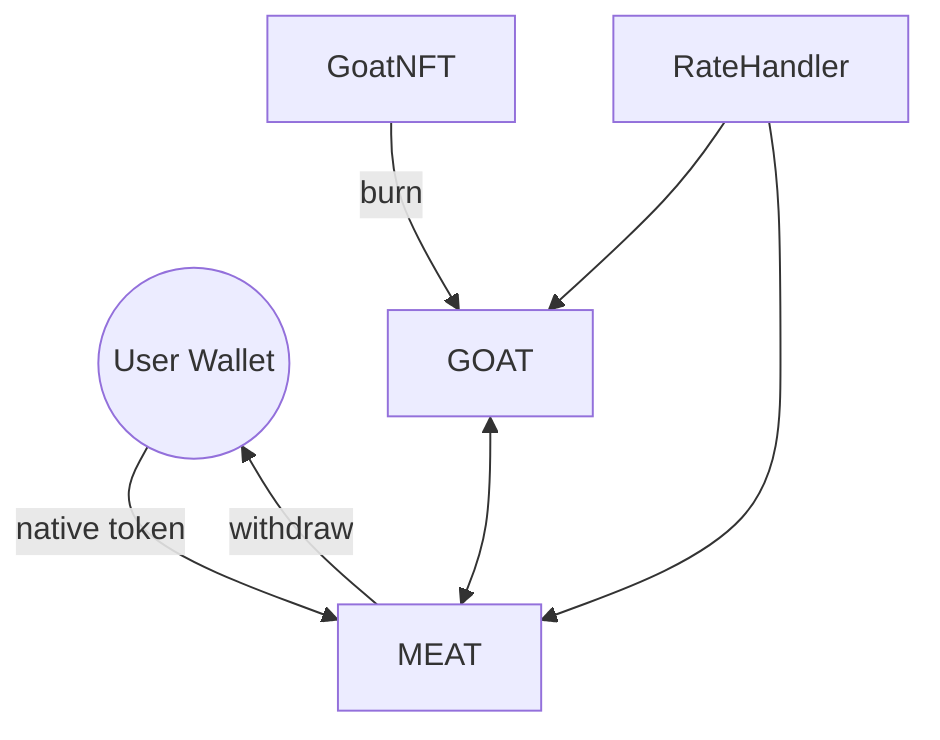

# Peta Kontrak

* **MEAT** berperan sebagai gerbang: menerima koin native, mencetak MEAT, dan menangani swap dua arah. Pemilik dapat menarik saldo native yang terkumpul.
* **GOAT** menerima suplai hasil cetak dari MEAT dan menyediakan fungsi staking. Reward serta parameter konfigurasi dapat diatur pemilik.
  - `emergencyUnstake` memungkinkan staker menarik token tanpa reward kapan saja.
* **FailingGOAT** hanya untuk pengujian; menerapkan antarmuka yang sama namun memungkinkan simulasi kegagalan transfer.
* **IGOAT** mendefinisikan fungsi `mintTo` yang memungkinkan MEAT mencetak GOAT bila diperlukan.
* **IGoatToken** dipakai GoatNFT agar kontrak GOAT dapat mencetak token saat NFT dibakar.
* **RateHandler** mengendalikan rasio swap terkini. `updateRate` memancarkan `RateUpdated` sedangkan `invalidateRate` mengembalikan nilai ke konstanta di `SwapConfig`.

Kontrak MEAT bergantung pada GOAT untuk mencetak token baru saat menukar MEAT menjadi GOAT. Keduanya memiliki pemilik yang sama yang dapat mengatur rate serta mengaktifkan atau menonaktifkan swap. Tabel di bawah merangkum kontrak utama beserta perannya.

| Kontrak | Deskripsi | Fungsi Kunci |
|---------|-----------|--------------|
| GOAT | Token ERC20 untuk staking yang dicetak oleh MEAT dan pembakaran GoatNFT. | `stake`, `unstake`, `claimReward`, `compoundReward`, `emergencyUnstake`, `mintTo`, `mint`, `setMEATAddress`, `setNFTAddress` |
| MEAT | Token ERC20 yang dicetak dengan deposit native dan dapat ditukar dengan GOAT. | `swapMEATForGOAT`, `swapGOATForMEAT`, `changeDepositRate`, `withdrawNative`, `setSwapEnabled`, `setGOATAddress` |
| GoatNFT | Identitas kambing ERC721 yang bisa ditebus menjadi GOAT. Metadata disimpan on-chain di `goatMetadata` sebagai `GoatData` (`nfcId`, `breed`, `birthYear`, `weight`, `mintedAt`). Berat dapat diperbarui via `updateWeight` (memancarkan `WeightUpdated`) dan harus segar saat dibakar. Pembakaran otomatis mencetak GOAT dan memancarkan `GoatBurned`. | `mint`, `updateWeight`, `burn`, `goatValue`, `goatMetadata`, `getGoatData` |
| IGOAT | Antarmuka pencetakan GOAT yang digunakan MEAT. | `mintTo` |
| IGoatToken | Antarmuka pencetakan GOAT yang digunakan GoatNFT. | `mint` |

GOAT memancarkan `MeatAddressUpdated` dan `NftAddressUpdated` setiap kali pemilik memperbarui alamat kontrak MEAT atau GoatNFT.
MEAT memancarkan `GoatAddressUpdated` setiap kali pemilik memperbarui alamat kontrak GOAT.
GoatNFT memancarkan `GoatTokenAddressUpdated` setiap kali pemilik memperbarui alamat token GOAT yang dipakai untuk mint.
