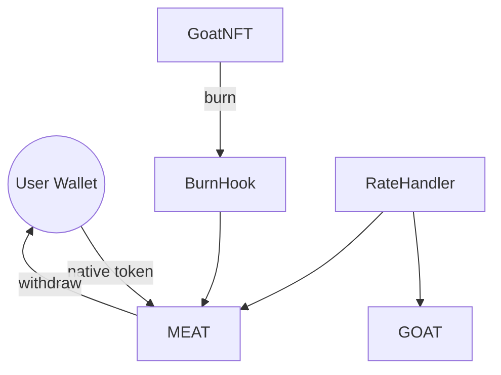

# Peta Kontrak

* **MEAT** berperan sebagai gerbang: menerima koin native, mencetak MEAT, dan mengontrol rasio deposit. Pemilik dapat menarik saldo native yang terkumpul.
* **GOAT** menerima suplai dari GoatNFTWrapper yang mencetak token saat NFT dibungkus. Reward serta parameter konfigurasi dapat diatur pemilik.
  - `emergencyUnstake` memungkinkan staker menarik token tanpa reward kapan saja.
* **FailingGOAT** hanya untuk pengujian; menerapkan antarmuka yang sama namun memungkinkan simulasi kegagalan transfer.
* **IGOAT** mendefinisikan fungsi `mintTo` yang memungkinkan GoatNFTWrapper mencetak GOAT.
* **IGoatToken** dipakai GoatNFTWrapper dan GoatNFT untuk berinteraksi dengan kontrak GOAT.
* **RateHandler** mengendalikan rasio swap terkini. `updateRate` memancarkan `RateUpdated` sedangkan `invalidateRate` mengembalikan nilai ke konstanta di `SwapConfig`.

Kontrak GOAT dan MEAT dimiliki alamat yang sama. Tabel di bawah merangkum kontrak utama beserta perannya.

| Kontrak | Deskripsi | Fungsi Kunci |
|---------|-----------|--------------|
| GOAT | Token ERC20 untuk staking yang dicetak oleh GoatNFTWrapper saat NFT dibungkus. | `stake`, `unstake`, `claimReward`, `compoundReward`, `emergencyUnstake`, `mintTo`, `mint` |
| MEAT | Token ERC20 yang dicetak dengan deposit native. | `changeDepositRate`, `withdrawNative`, `setGOATAddress` |
| GoatNFT | Identitas kambing ERC721 yang menyimpan metadata di `goatMetadata` sebagai `GoatData` (`nfcId`, `breed`, `birthYear`, `weight`, `mintedAt`). Berat dapat diperbarui via `updateWeight` (memancarkan `WeightUpdated`) dan harus segar saat dibakar. Fungsi `burn` memicu `GoatNFTBurnHook` serta event `GoatBurned`. | `mint`, `updateWeight`, `burn`, `goatValue`, `goatMetadata`, `getGoatData` |
| GoatNFTBurnHook | Kontrak hook yang mencetak `GOATMEAT` setiap kali GoatNFT dibakar. | `onBurn` |
| GoatNFTWrapper | Mengunci GoatNFT dan mencetak GOAT setara hingga NFT dibuka kembali dengan membakar GOAT. | `wrap`, `unwrap`, `setRateHandler` |
| IGOAT | Antarmuka pencetakan GOAT yang digunakan GoatNFTWrapper. | `mintTo` |
| IGoatToken | Antarmuka pencetakan GOAT yang digunakan GoatNFTWrapper dan GoatNFT. | `mint`, `burnFrom` |

