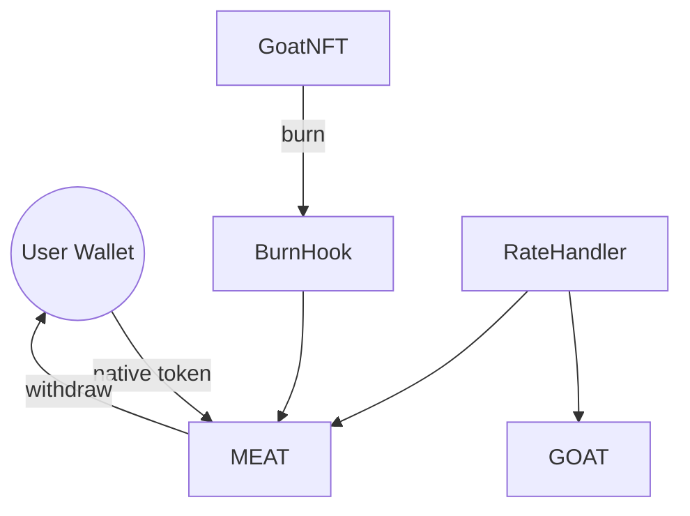

# Peta Kontrak

* **MEAT** berperan sebagai gerbang: menerima koin native, mencetak MEAT, dan mengontrol rasio deposit. Pemilik dapat menarik saldo native yang terkumpul.
* **GOAT** menerima suplai dari GoatNFTWrapper yang mencetak token saat NFT dibungkus. Reward serta parameter konfigurasi dapat diatur pemilik.
* **FailingGOAT** hanya untuk pengujian; menerapkan antarmuka yang sama namun memungkinkan simulasi kegagalan transfer.
* **IGOAT** mendefinisikan fungsi `mintTo` yang memungkinkan GoatNFTWrapper mencetak GOAT.
* **IGoatToken** dipakai GoatNFTWrapper dan GoatNFT untuk berinteraksi dengan kontrak GOAT.
* **RateHandler** mengendalikan rasio swap terkini untuk barter produk.
* **RedeemEngine** memproses penebusan MEAT dan memverifikasi lineage sebelum pembakaran.
* **SapiNFT** menyimpan identitas sapi ERC721 dan metadata di `sapiMetadata`.
* **SapiNFTBurnHook** mencetak `BEEFMEAT` setiap kali SapiNFT dibakar.
* **SapiNFTWrapper** mengunci SapiNFT dan mencetak GOAT hingga NFT dibuka kembali.

Kontrak GOAT dan MEAT dimiliki alamat yang sama. Tabel di bawah merangkum kontrak utama beserta perannya.

| Kontrak | Deskripsi |
|---------|-----------|
| GOAT | Token ERC20 untuk staking yang dicetak oleh GoatNFTWrapper saat NFT dibungkus. |
| MEAT | Token ERC20 yang dicetak dengan deposit native. |
| GoatNFT | Identitas kambing ERC721 yang menyimpan metadata di `goatMetadata` sebagai `GoatData` (`nfcId`, `breed`, `birthYear`, `weight`, `mintedAt`). Berat dapat diperbarui via `updateWeight` dan harus segar saat dibakar. Fungsi `burn` memicu `GoatNFTBurnHook` serta event `GoatBurned`. |
| GoatNFTBurnHook | Kontrak hook yang mencetak `GOATMEAT` setiap kali GoatNFT dibakar. |
| GoatNFTWrapper | Mengunci GoatNFT dan mencetak GOAT setara hingga NFT dibuka kembali dengan membakar GOAT. |
| SapiNFT | Identitas sapi ERC721 yang menyimpan metadata di `sapiMetadata` sebagai `SapiData` (`nfcId`, `breed`, `birthYear`, `weight`, `mintedAt`). Berat dapat diperbarui via `updateWeight` dan harus segar saat dibakar. Fungsi `burn` memicu `SapiNFTBurnHook` serta event `SapiBurned`. |
| SapiNFTBurnHook | Kontrak hook yang mencetak `BEEFMEAT` setiap kali SapiNFT dibakar. |
| SapiNFTWrapper | Mengunci SapiNFT dan mencetak GOAT setara hingga NFT dibuka kembali dengan membakar GOAT. |
| IGOAT | Antarmuka pencetakan GOAT yang digunakan GoatNFTWrapper. |
| IGoatToken | Antarmuka pencetakan GOAT yang digunakan GoatNFTWrapper dan GoatNFT. |
| RedeemEngine | Memverifikasi lineage dan membakar subtype MEAT saat penebusan. |

