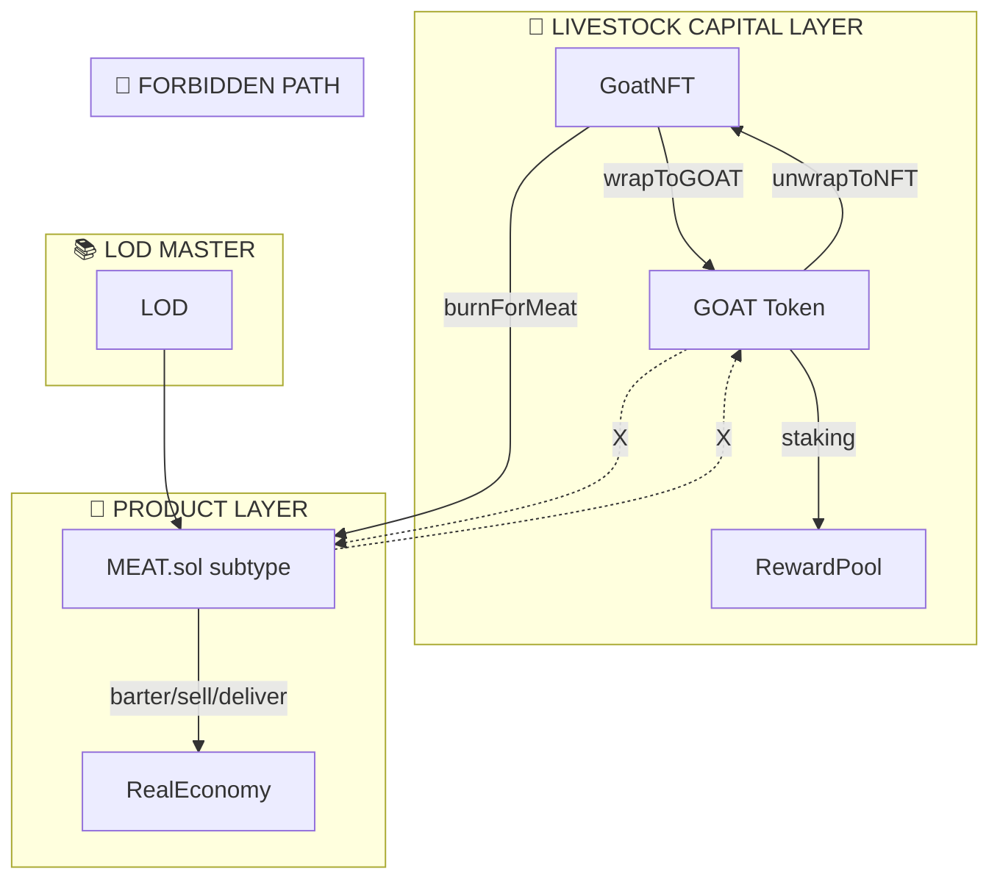

# Revolusi Moneter 5.0

White paper ini merangkum visi, arsitektur, dan siklus tokenisasi **GOAT** serta **MEAT** yang dijelaskan di repositori ini.

## Pengantar
Sistem terdiri dari dua token ERC20:

- **GOAT** – token finansial yang diperoleh dengan membungkus `GoatNFT` melalui `GoatNFTWrapper` dan digunakan untuk staking.
- **MEAT** – token produk yang dicetak eksklusif melalui `mintSubtype()` oleh kontrak terotorisasi seperti `GoatNFTBurnHook`.

Interaksi keduanya membentuk siklus nilai hidup mulai dari ternak hingga produk fisik.

## Arsitektur Sistem
Kontrak utama antara lain `GOAT.sol`, `MEAT.sol`, `GoatNFT`, dan `RateHandler`. Diagram mermaid berikut berasal dari [architecture.md](../architecture.md):

## Siklus Hidup
Berdasarkan [goat-meat-lifecycle.md](goat-meat-lifecycle.md), setiap `GoatNFT` dapat:

1. Dibungkus menjadi GOAT untuk staking.
2. Dibakar melalui hook yang mencetak subtype *MEAT* sesuai berat ternak.
3. Token MEAT dapat dibarter ke produk lain dengan `BarterEngine` atau ditebus melalui `RedeemEngine`. Port CosmWasm untuk `BarterEngine` masih dalam pengerjaan.

## Governance dan LOD Engine
White paper ini mengikuti panduan [governance-lod-engine.md](governance-lod-engine.md). LOD Engine menetapkan paritas komoditas melalui fungsi `setCommodityRepresentation`. Setiap pembaruan diwajibkan melewati pipeline governansi dan diuji dengan Hardhat.

## Visi
Repositori ini bertujuan mewujudkan *Monetary 5.0* – sistem transparan berbasis siklus hidup, anti inflasi, dan terbuka untuk adopsi komunitas. Nilai diikat pada aktivitas nyata dengan meniadakan mint/burn sewenang-wenang.

## Referensi
- [README](../README.md)
- [Architecture](../architecture.md)
- [GOAT & MEAT Lifecycle](goat-meat-lifecycle.md)
- [Governance LOD Engine](governance-lod-engine.md)
